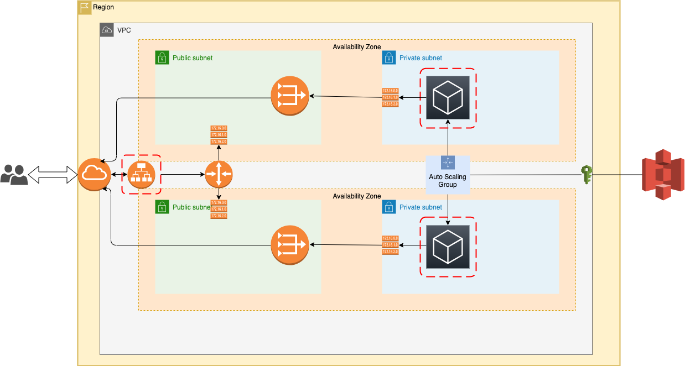

# The architecture diagram

 

 ### URL for accessing site:
 http://udagr-WebAp-NSGDE23GU77E-1202299331.us-west-2.elb.amazonaws.com

### CODE 
The cloud formation code is in templates folder
### How the CF code stacks are defined
  * Roles: 
  All the roles are defined in ./templates/roles.yml
  * Networking: 
  All the vpc, subnets, etc are defined in ./templates/networks.yml
  * Web Server: 
  All the webserver, loadbalancer, listeners, security groups, launch configurations,etc are defined in ./templates/workloads.yml

 # cloudformation scripts to create infrastructure on aws 

## how to create stack

### Role Stack

<PROJECT_ROOT> #> ./scripts/create-roles.sh

### Network Stack

<PROJECT_ROOT> #> ./scripts/create-network.sh

### Web Server Stack

<PROJECT_ROOT> #> ./scripts/create-workload.sh


## how to update stack 

### Role Stack

<PROJECT_ROOT> #> ./scripts/update-roles.sh 

### Network Stack

<PROJECT_ROOT> #> ./scripts/update-network.sh

### Web Server Stack

<PROJECT_ROOT> #> ./scripts/update-workload.sh


## how to delete stack

### Role Stack

<PROJECT_ROOT> #> ./scripts/delete-roles.sh

### Network Stack

<PROJECT_ROOT> #> ./scripts/delete-network.sh

### Web Server Stack

<PROJECT_ROOT> #> ./scripts/delete-workload.sh


# Unit Testing for cloudformation

## TaskCat 

### what is taskcat 

taskcat is a tool that tests AWS CloudFormation templates. It deploys your AWS CloudFormation template in multiple AWS Regions and generates a report with a pass/fail grade for each region. You can specify the regions and number of Availability Zones you want to include in the test, and pass in parameter values from your AWS CloudFormation template. taskcat is implemented as a Python class that you import, instantiate, and run.

### how to configure: 

The configuration is done using /.taskcat.yml
Note: a key pair is should be provided to access 
for ex: KeyPair: my-test-ec2-keypair

gist below

```cf
project:
  name: udagram
tests:
  mytest:
    template: templates/networks.yml
    regions:
      - us-west-2
```

### how to run:

from this project home directory
> `taskcat test run`

This will run CF scripts and create the stacks and delete it.
> `taskcat test run`

if you want to run the taskcat and keep the rosources
> `taskcat test run -n`

delete the resources after running taskcat
> `taskcat test clean udagram -r us-west-2`